# VertiMonitor Frontend — Backend Interaction Flows

**Repository:** `VertiMonitor_FE` (`app-segregated/` component)
**Authors / Contributors:** Suman Halder, Dario Milani
**Version:** 3.0
**Date:** September 28, 2026

Companion to `vertimonitor_frontend.md`. For each use case, this doc shows
which frontend file calls which backend endpoint, in what order, with which
method and payload. The diagrams are Mermaid, which renders on GitHub,
GitLab and in the VS Code Markdown preview.

**Legend**
- **UM API**: DMAT User Management, `https://login.dm-airtech.com/api`
- **FC API**: VertiMonitor Forecast, `https://api.vertimonitor.dm-airtech.com/forecast`
- Every FC API call sends `X-User-API-Key: <key from utils/auth.js getValidApiKey()>`.
- *(verify)* marks the few steps that depend on files not reviewed for this doc.

## Table of Contents
- [0. System Overview](#overview)
- [1. Login and Session Bootstrap](#login)
- [1b. Layout and Routing](#routing)
- [1c. Decision Modals and Result Cache](#decision-cache)
- [2. Trajectory Planning Sidebar (UAS + Manned)](#sidebar)
- [3. UAS Weather Decision](#uas-decision)
- [4. Manned Weather Decision](#manned-decision)
- [5. Vertiport Dashboard](#vertiport-dashboard)
- [6. Vertiport and Weather Station Management](#resource-management)
- [7. Missions](#missions)
- [8. Legacy / Unreachable Code](#legacy)
- [9. Polling and Caching Summary](#polling)
- [10. Endpoint → Caller Matrix](#matrix)

---

## 0. System Overview

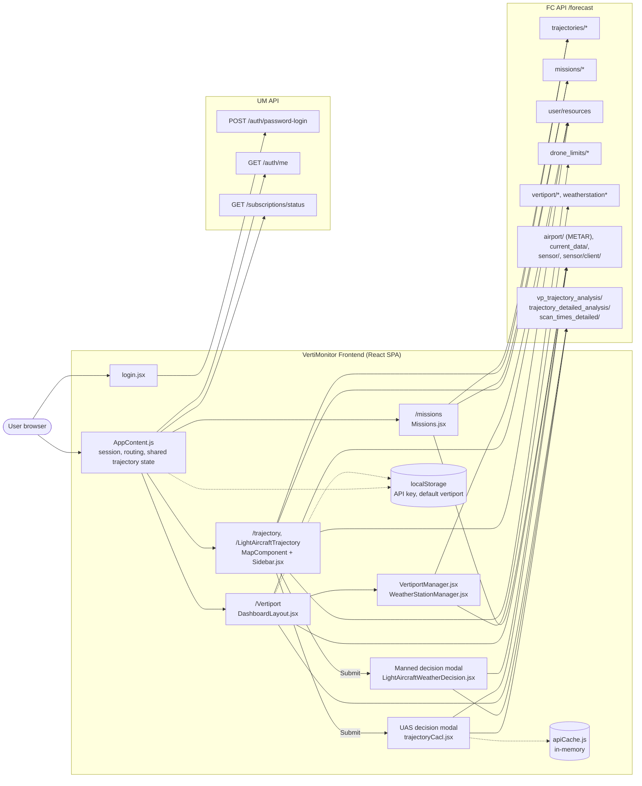
```mermaid
flowchart LR
    U([User browser])

    subgraph FE["VertiMonitor Frontend (React SPA)"]
        LOGIN[login.jsx]
        APP["AppContent.js<br/>session, routing, shared trajectory state"]
        PLAN["/trajectory, /LightAircraftTrajectory<br/>MapComponent + Sidebar.jsx"]
        UASD["UAS decision modal<br/>trajectoryCacl.jsx"]
        MAND["Manned decision modal<br/>LightAircraftWeatherDecision.jsx"]
        VP["/Vertiport<br/>DashboardLayout.jsx"]
        VPM["VertiportManager.jsx<br/>WeatherStationManager.jsx"]
        MIS["/missions<br/>Missions.jsx"]
        C1[("apiCache.js<br/>in-memory")]
        C2[("localStorage<br/>API key, default vertiport")]
    end

    subgraph UM["UM API"]
        UM1["POST /auth/password-login"]
        UM2["GET /auth/me"]
        UM3["GET /subscriptions/status"]
    end

    subgraph FC["FC API /forecast"]
        F1["trajectories/*"]
        F2["missions/*"]
        F3["user/resources"]
        F4["drone_limits/*"]
        F5["vertiport/*, weatherstation*"]
        F6["airport/ (METAR), current_data/,<br/>sensor/, sensor/client/"]
        F7["vp_trajectory_analysis/<br/>trajectory_detailed_analysis/<br/>scan_times_detailed/"]
    end

    U --> LOGIN --> UM1
    U --> APP --> UM2 & UM3
    APP --> PLAN & VP & MIS
    PLAN -- Submit --> UASD & MAND
    PLAN --> F1 & F2 & F3 & F4
    UASD --> F7 & F6
    MAND --> F7 & F6
    VP --> F3 & F6 & F7
    VP --> VPM --> F3 & F5
    MIS --> F1 & F2 & F6
    UASD -.-> C1
    APP -.-> C2
    VP -.-> C2
```

---

## 1. Login and Session Bootstrap

**Files:**
- `AppContent.js`: the auth `useEffect`, `fetchUserInfo`, `fetchSubscriptionStatus`, `handleLogout`
- `pages/login.jsx`: `handleSubmit`
- `utils/auth.js`: `getValidApiKey`

The "session" is just the API key in `localStorage` (`userApiKey`), with an
expiry set on the client (`userApiKeyExpiresAt`, now + 24 h). There's no
token refresh. `AppContent` checks the key once, when it mounts. Every
component then calls `getValidApiKey()` again just before each request.

There are three ways into the app:
1. **Hash hand-off:** the user arrives from `login.dm-airtech.com` with `#apiKey=…` in the URL.
2. **Stored key:** a key already in `localStorage` that hasn't expired.
3. **Password login** on the VertiMonitor login page.

### 1a. Resolving the API key on page load

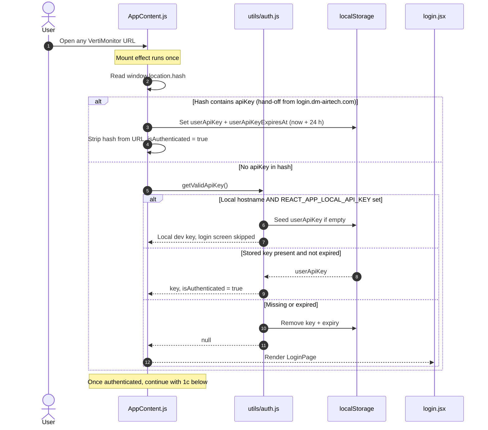
```mermaid
sequenceDiagram
    autonumber
    actor User
    participant App as AppContent.js
    participant Auth as utils/auth.js
    participant LS as localStorage
    participant Login as login.jsx

    User->>App: Open any VertiMonitor URL
    Note over App: Mount effect runs once
    App->>App: Read window.location.hash
    alt Hash contains apiKey (hand-off from login.dm-airtech.com)
        App->>LS: Set userApiKey + userApiKeyExpiresAt (now + 24 h)
        App->>App: Strip hash from URL, isAuthenticated = true
    else No apiKey in hash
        App->>Auth: getValidApiKey()
        alt Local hostname AND REACT_APP_LOCAL_API_KEY set
            Auth->>LS: Seed userApiKey if empty
            Auth-->>App: Local dev key, login screen skipped
        else Stored key present and not expired
            LS-->>Auth: userApiKey
            Auth-->>App: key, isAuthenticated = true
        else Missing or expired
            Auth->>LS: Remove key + expiry
            Auth-->>App: null
            App-->>Login: Render LoginPage
        end
    end
    Note over App: Once authenticated, continue with 1c below
```

`getValidApiKey()` treats the hostname as local when it is `localhost` or
`127.0.0.1`, starts with `192.168.`, or contains the word `local`.

### 1b. Password login

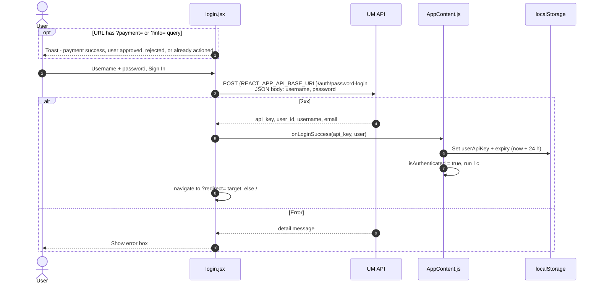
```mermaid
sequenceDiagram
    autonumber
    actor User
    participant Login as login.jsx
    participant UM as UM API
    participant App as AppContent.js
    participant LS as localStorage

    opt URL has ?payment= or ?info= query
        Login-->>User: Toast - payment success, user approved, rejected, or already actioned
    end
    User->>Login: Username + password, Sign In
    Login->>UM: POST {REACT_APP_API_BASE_URL}/auth/password-login<br/>JSON body: username, password
    alt 2xx
        UM-->>Login: api_key, user_id, username, email
        Login->>App: onLoginSuccess(api_key, user)
        App->>LS: Set userApiKey + expiry (now + 24 h)
        App->>App: isAuthenticated = true, run 1c
        Login->>Login: navigate to ?redirect= target, else /
    else Error
        UM-->>Login: detail message
        Login-->>User: Show error box
    end
```

"Forgot password?" and "Register" are plain links to
`login.dm-airtech.com/forgot-password` and `/register`. They leave the app.

### 1c. After authentication: user info and subscription

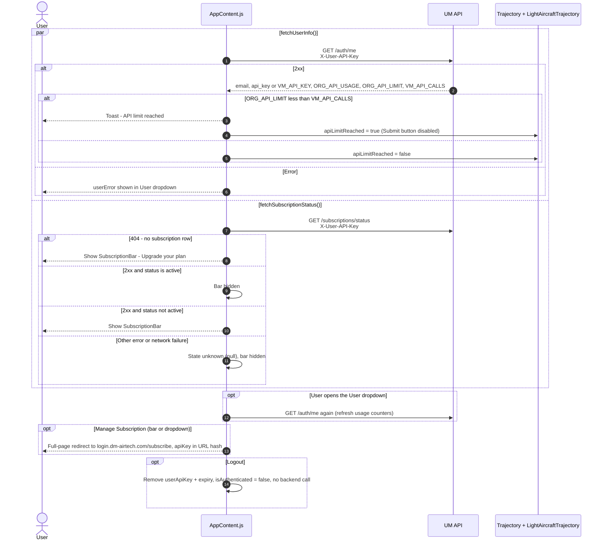
```mermaid
sequenceDiagram
    autonumber
    actor User
    participant App as AppContent.js
    participant UM as UM API
    participant Pages as Trajectory + LightAircraftTrajectory

    par fetchUserInfo()
        App->>UM: GET /auth/me<br/>X-User-API-Key
        alt 2xx
            UM-->>App: email, api_key or VM_API_KEY, ORG_API_USAGE, ORG_API_LIMIT, VM_API_CALLS
            alt ORG_API_LIMIT less than VM_API_CALLS
                App-->>User: Toast - API limit reached
                App->>Pages: apiLimitReached = true (Submit button disabled)
            else
                App->>Pages: apiLimitReached = false
            end
        else Error
            App-->>User: userError shown in User dropdown
        end
    and fetchSubscriptionStatus()
        App->>UM: GET /subscriptions/status<br/>X-User-API-Key
        alt 404 - no subscription row
            App-->>User: Show SubscriptionBar - Upgrade your plan
        else 2xx and status is active
            App->>App: Bar hidden
        else 2xx and status not active
            App-->>User: Show SubscriptionBar
        else Other error or network failure
            App->>App: State unknown (null), bar hidden
        end
    end

    opt User opens the User dropdown
        App->>UM: GET /auth/me again (refresh usage counters)
    end
    opt Manage Subscription (bar or dropdown)
        App-->>User: Full-page redirect to login.dm-airtech.com/subscribe, apiKey in URL hash
    end
    opt Logout
        App->>App: Remove userApiKey + expiry, isAuthenticated = false, no backend call
    end
```

The subscription status **never blocks features**. It only toggles the
upgrade bar. The only feature gate is `apiLimitReached`, which disables the
Submit button on the two planning pages. A separate red banner appears when
`ORG_API_USAGE >= ORG_API_LIMIT`.

---

## 1b. Layout and Routing

The three route blocks in `AppContent.js` are **layout branches** (missions,
mobile, desktop). They have nothing to do with subscription state.

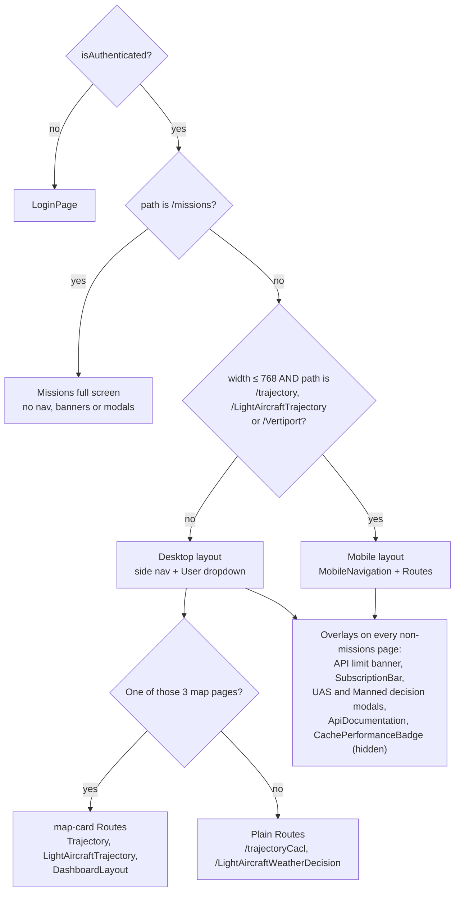
```mermaid
flowchart TD
    A{isAuthenticated?} -- no --> L[LoginPage]
    A -- yes --> M{"path is /missions?"}
    M -- yes --> MF["Missions full screen<br/>no nav, banners or modals"]
    M -- no --> MOB{"width ≤ 768 AND path is<br/>/trajectory, /LightAircraftTrajectory<br/>or /Vertiport?"}
    MOB -- yes --> ML["Mobile layout<br/>MobileNavigation + Routes"]
    MOB -- no --> D["Desktop layout<br/>side nav + User dropdown"]
    D --> TP{"One of those 3 map pages?"}
    TP -- yes --> MC["map-card Routes<br/>Trajectory, LightAircraftTrajectory,<br/>DashboardLayout"]
    TP -- no --> PR["Plain Routes<br/>/trajectoryCacl, /LightAircraftWeatherDecision"]
    ML --> O["Overlays on every non-missions page:<br/>API limit banner, SubscriptionBar,<br/>UAS and Manned decision modals,<br/>ApiDocumentation, CachePerformanceBadge (hidden)"]
    D --> O
```

---

## 1c. Decision Modals and Result Cache

`AppContent.js` holds all trajectory state: waypoints, mission start and end,
aircraft ID, weather model and limit bounds. It passes this state to both the
planning pages and the decision components.

The Submit button on a planning page opens the decision as a **modal**
rendered by `AppContent`. It doesn't navigate to a route.

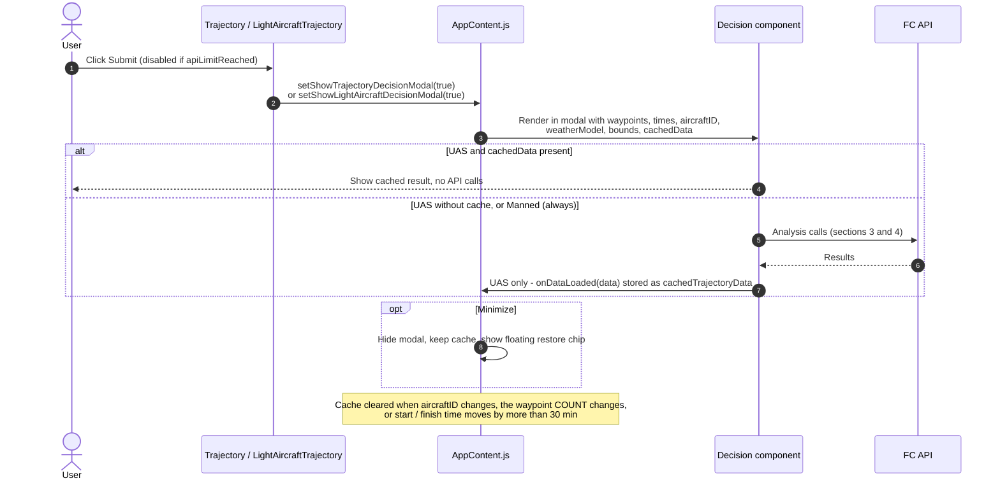
```mermaid
sequenceDiagram
    autonumber
    actor User
    participant TP as Trajectory / LightAircraftTrajectory
    participant App as AppContent.js
    participant DM as Decision component
    participant FC as FC API

    User->>TP: Click Submit (disabled if apiLimitReached)
    TP->>App: setShowTrajectoryDecisionModal(true)<br/>or setShowLightAircraftDecisionModal(true)
    App->>DM: Render in modal with waypoints, times, aircraftID,<br/>weatherModel, bounds, cachedData
    alt UAS and cachedData present
        DM-->>User: Show cached result, no API calls
    else UAS without cache, or Manned (always)
        DM->>FC: Analysis calls (sections 3 and 4)
        FC-->>DM: Results
        DM->>App: UAS only - onDataLoaded(data) stored as cachedTrajectoryData
    end
    opt Minimize
        App->>App: Hide modal, keep cache, show floating restore chip
    end
    Note over App: Cache cleared when aircraftID changes, the waypoint COUNT changes,<br/>or start / finish time moves by more than 30 min
```

> `LightAircraftWeatherDecision.jsx` doesn't accept `cachedData` or
> `onDataLoaded`. The manned modal therefore **refetches every time it opens
> or is restored**, and `cachedLightAircraftData` is never filled.

---

## 2. Trajectory Planning Sidebar (UAS + Manned)

**Files:** `components/Sidebar.jsx`,
`components/MissionSidebarSection.jsx`, `pages/LightAircraftTrajectory.jsx`,
and `pages/Trajectory.jsx` *(verify)*.

Both planning pages render the same `Sidebar.jsx`. The flag
`isLightAircraft` switches a few fields: manned has per-waypoint ETAs and
free-entry altitude, while UAS has altitudes of 10–180 m, the Kp index and
the operational window.

Waypoints are added by map click or by manual lat/lon entry, with no backend
call. On manned, each new waypoint gets an ETA of now + 5 min × its position
in the list.

### 2a. Aircraft profiles (drone limits)

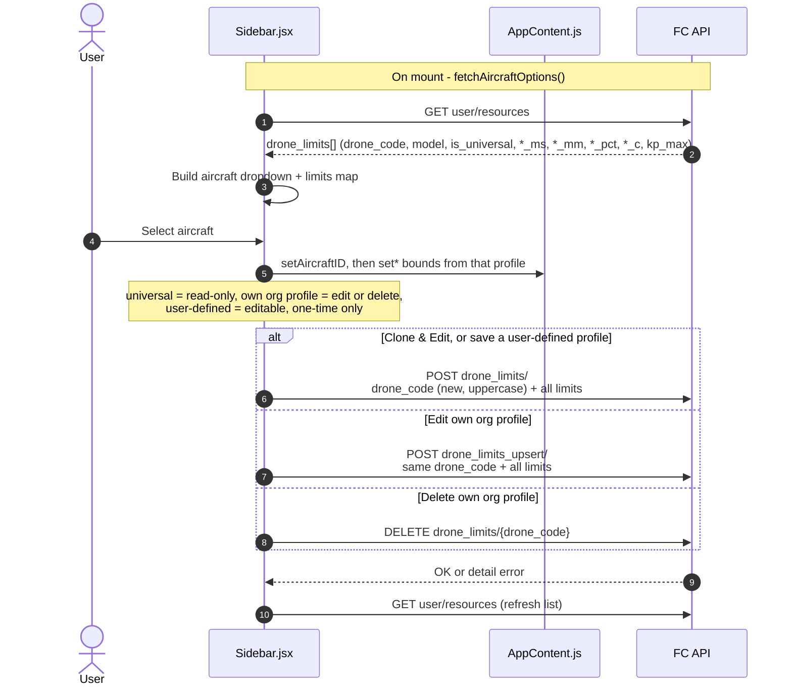
```mermaid
sequenceDiagram
    autonumber
    actor User
    participant SB as Sidebar.jsx
    participant App as AppContent.js
    participant FC as FC API

    Note over SB,FC: On mount - fetchAircraftOptions()
    SB->>FC: GET user/resources
    FC-->>SB: drone_limits[] (drone_code, model, is_universal, *_ms, *_mm, *_pct, *_c, kp_max)
    SB->>SB: Build aircraft dropdown + limits map

    User->>SB: Select aircraft
    SB->>App: setAircraftID, then set* bounds from that profile
    Note over SB: universal = read-only, own org profile = edit or delete,<br/>user-defined = editable, one-time only

    alt Clone & Edit, or save a user-defined profile
        SB->>FC: POST drone_limits/<br/>drone_code (new, uppercase) + all limits
    else Edit own org profile
        SB->>FC: POST drone_limits_upsert/<br/>same drone_code + all limits
    else Delete own org profile
        SB->>FC: DELETE drone_limits/{drone_code}
    end
    FC-->>SB: OK or detail error
    SB->>FC: GET user/resources (refresh list)
```

### 2b. Trajectories: list, load, save, update

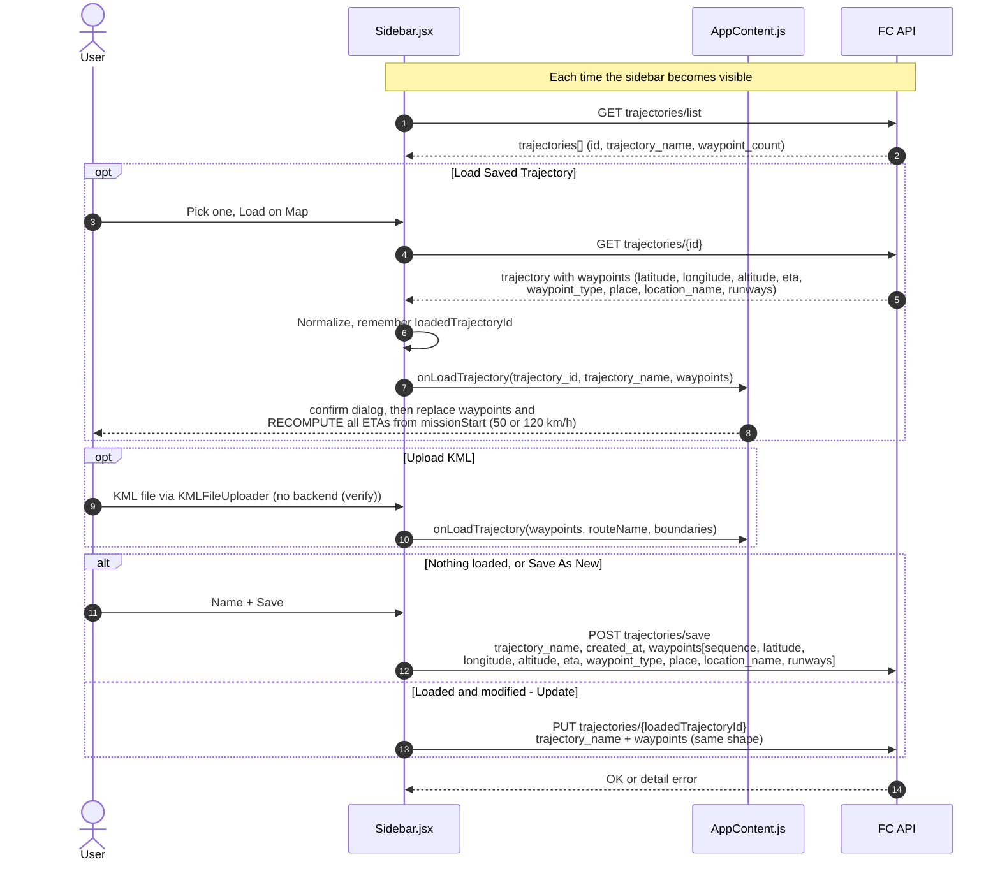
```mermaid
sequenceDiagram
    autonumber
    actor User
    participant SB as Sidebar.jsx
    participant App as AppContent.js
    participant FC as FC API

    Note over SB,FC: Each time the sidebar becomes visible
    SB->>FC: GET trajectories/list
    FC-->>SB: trajectories[] (id, trajectory_name, waypoint_count)

    opt Load Saved Trajectory
        User->>SB: Pick one, Load on Map
        SB->>FC: GET trajectories/{id}
        FC-->>SB: trajectory with waypoints (latitude, longitude, altitude, eta,<br/>waypoint_type, place, location_name, runways)
        SB->>SB: Normalize, remember loadedTrajectoryId
        SB->>App: onLoadTrajectory(trajectory_id, trajectory_name, waypoints)
        App-->>User: confirm dialog, then replace waypoints and<br/>RECOMPUTE all ETAs from missionStart (50 or 120 km/h)
    end

    opt Upload KML
        User->>SB: KML file via KMLFileUploader (no backend (verify))
        SB->>App: onLoadTrajectory(waypoints, routeName, boundaries)
    end

    alt Nothing loaded, or Save As New
        User->>SB: Name + Save
        SB->>FC: POST trajectories/save<br/>trajectory_name, created_at, waypoints[sequence, latitude,<br/>longitude, altitude, eta, waypoint_type, place, location_name, runways]
    else Loaded and modified - Update
        SB->>FC: PUT trajectories/{loadedTrajectoryId}<br/>trajectory_name + waypoints (same shape)
    end
    FC-->>SB: OK or detail error
```

### 2c. Save a mission from the sidebar

`MissionSidebarSection.jsx` ("Mission Tracking") reuses the trajectory list
the Sidebar already fetched. It makes no list call of its own.

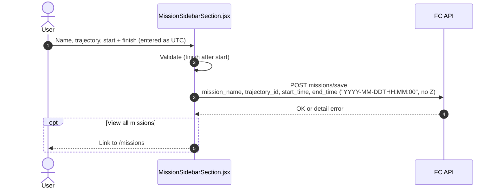
```mermaid
sequenceDiagram
    autonumber
    actor User
    participant MS as MissionSidebarSection.jsx
    participant FC as FC API

    User->>MS: Name, trajectory, start + finish (entered as UTC)
    MS->>MS: Validate (finish after start)
    MS->>FC: POST missions/save<br/>mission_name, trajectory_id, start_time, end_time ("YYYY-MM-DDTHH:MM:00", no Z)
    FC-->>MS: OK or detail error
    opt View all missions
        MS-->>User: Link to /missions
    end
```

---

## 3. UAS Weather Decision

**Files:** `pages/trajectoryCacl.jsx` (`TrajectoryWeatherDecision`),
`utils/apiCache.js`, `utils/metarDecoder.js`,
`components/TrajectoryMatrix.jsx`

Preconditions: at least one waypoint, plus `missionStart`, `missionEnd` and
`aircraftID`. If any is missing, the component shows nothing and makes no
calls.

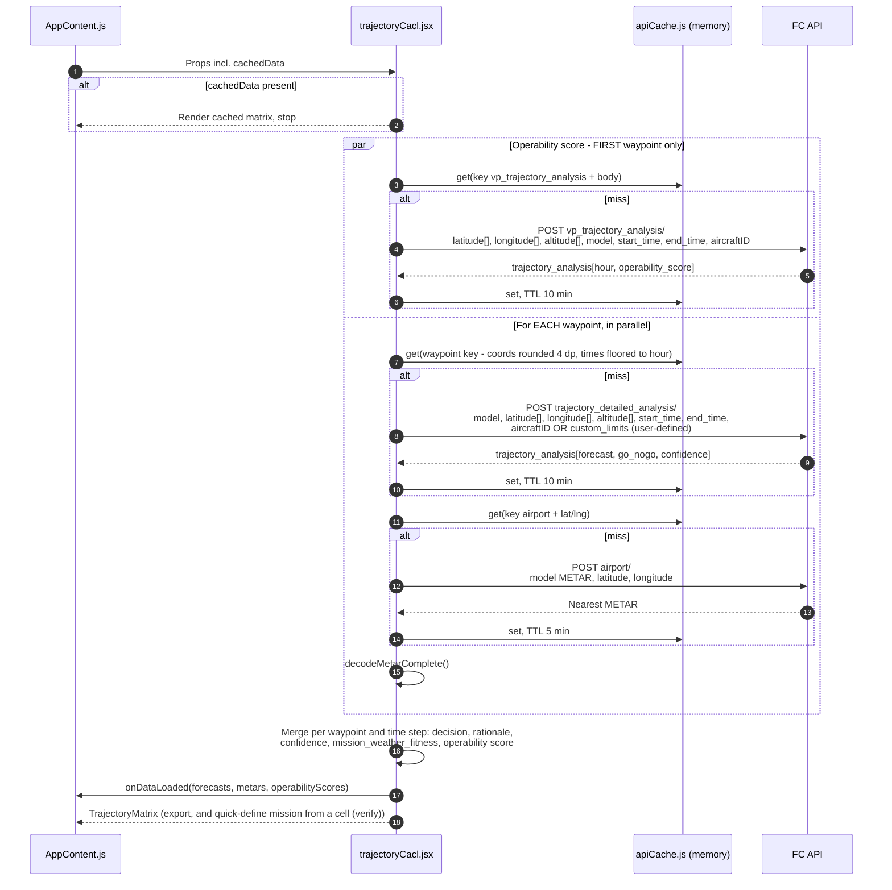
```mermaid
sequenceDiagram
    autonumber
    participant App as AppContent.js
    participant P as trajectoryCacl.jsx
    participant C as apiCache.js (memory)
    participant FC as FC API

    App->>P: Props incl. cachedData
    alt cachedData present
        P-->>App: Render cached matrix, stop
    end

    par Operability score - FIRST waypoint only
        P->>C: get(key vp_trajectory_analysis + body)
        alt miss
            P->>FC: POST vp_trajectory_analysis/<br/>latitude[], longitude[], altitude[], model, start_time, end_time, aircraftID
            FC-->>P: trajectory_analysis[hour, operability_score]
            P->>C: set, TTL 10 min
        end
    and For EACH waypoint, in parallel
        P->>C: get(waypoint key - coords rounded 4 dp, times floored to hour)
        alt miss
            P->>FC: POST trajectory_detailed_analysis/<br/>model, latitude[], longitude[], altitude[], start_time, end_time,<br/>aircraftID OR custom_limits (user-defined)
            FC-->>P: trajectory_analysis[forecast, go_nogo, confidence]
            P->>C: set, TTL 10 min
        end
        P->>C: get(key airport + lat/lng)
        alt miss
            P->>FC: POST airport/<br/>model METAR, latitude, longitude
            FC-->>P: Nearest METAR
            P->>C: set, TTL 5 min
        end
        P->>P: decodeMetarComplete()
    end

    P->>P: Merge per waypoint and time step: decision, rationale,<br/>confidence, mission_weather_fitness, operability score
    P->>App: onDataLoaded(forecasts, metars, operabilityScores)
    P-->>App: TrajectoryMatrix (export, and quick-define mission from a cell (verify))
```

For each waypoint, the forecast call and the METAR call run one after the
other, but different waypoints run in parallel. A failed waypoint adds its
error message and doesn't stop the others. The result is always passed to
`onDataLoaded`, even when it's partial.

---

## 4. Manned Weather Decision

**Files:** `pages/LightAircraftWeatherDecision.jsx`,
`components/LightAircraftTrajectoryMatrix.jsx`, `utils/metarDecoder.js`

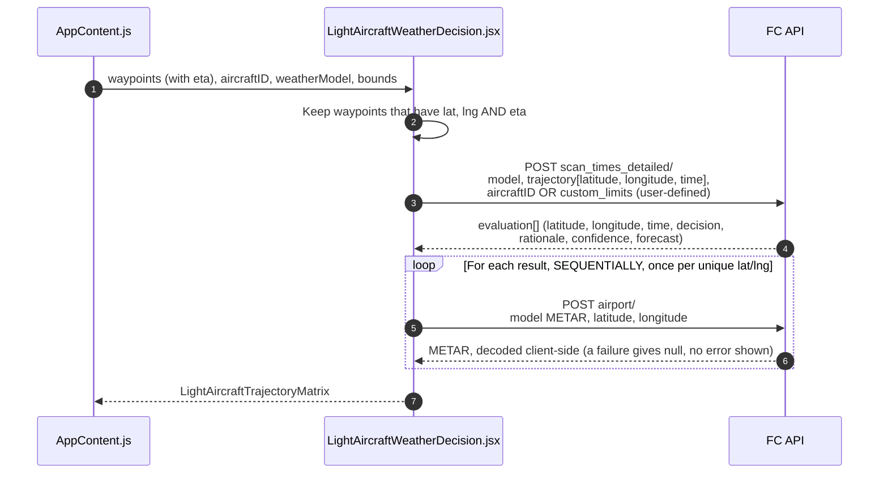
```mermaid
sequenceDiagram
    autonumber
    participant App as AppContent.js
    participant P as LightAircraftWeatherDecision.jsx
    participant FC as FC API

    App->>P: waypoints (with eta), aircraftID, weatherModel, bounds
    P->>P: Keep waypoints that have lat, lng AND eta
    P->>FC: POST scan_times_detailed/<br/>model, trajectory[latitude, longitude, time],<br/>aircraftID OR custom_limits (user-defined)
    FC-->>P: evaluation[] (latitude, longitude, time, decision,<br/>rationale, confidence, forecast)
    loop For each result, SEQUENTIALLY, once per unique lat/lng
        P->>FC: POST airport/<br/>model METAR, latitude, longitude
        FC-->>P: METAR, decoded client-side (a failure gives null, no error shown)
    end
    P-->>App: LightAircraftTrajectoryMatrix
```

There's no `apiCache` here and no parent cache (see 1c). The call refires when
`waypoints`, `aircraftID` or `weatherModel` change. It does **not** refire
when only the user-defined bounds change.

---

## 5. Vertiport Dashboard (`/Vertiport`)

**Files:** `layouts/DashboardLayout.jsx`, `utils/vertiportCache.js`,
`utils/dummySensorData.js`, `utils/weatherDecisionEvaluator.js`,
`components/DecisionMatrix.js`, `pages/DetailsBox.jsx`

### 5a. Startup and polling

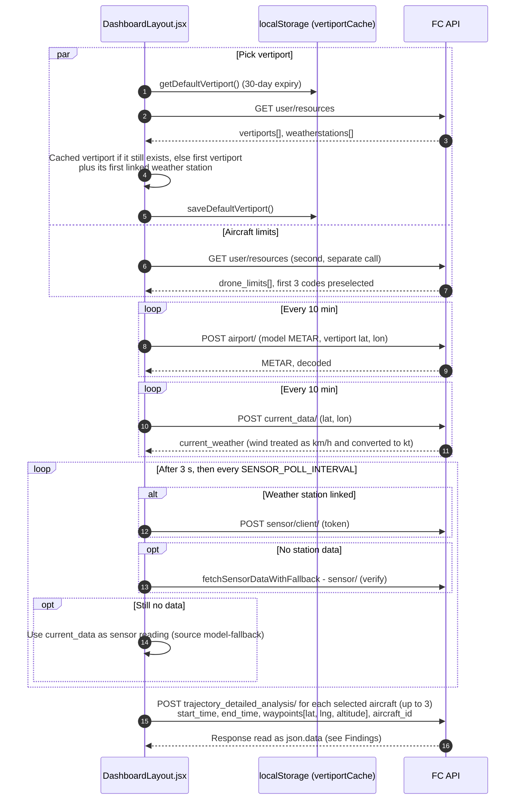
```mermaid
sequenceDiagram
    autonumber
    participant D as DashboardLayout.jsx
    participant LS as localStorage (vertiportCache)
    participant FC as FC API

    par Pick vertiport
        D->>LS: getDefaultVertiport() (30-day expiry)
        D->>FC: GET user/resources
        FC-->>D: vertiports[], weatherstations[]
        D->>D: Cached vertiport if it still exists, else first vertiport<br/>plus its first linked weather station
        D->>LS: saveDefaultVertiport()
    and Aircraft limits
        D->>FC: GET user/resources (second, separate call)
        FC-->>D: drone_limits[], first 3 codes preselected
    end

    loop Every 10 min
        D->>FC: POST airport/ (model METAR, vertiport lat, lon)
        FC-->>D: METAR, decoded
    end
    loop Every 10 min
        D->>FC: POST current_data/ (lat, lon)
        FC-->>D: current_weather (wind treated as km/h and converted to kt)
    end
    loop After 3 s, then every SENSOR_POLL_INTERVAL
        alt Weather station linked
            D->>FC: POST sensor/client/ (token)
        end
        opt No station data
            D->>FC: fetchSensorDataWithFallback - sensor/ (verify)
        end
        opt Still no data
            D->>D: Use current_data as sensor reading (source model-fallback)
        end
    end
    D->>FC: POST trajectory_detailed_analysis/ for each selected aircraft (up to 3)<br/>start_time, end_time, waypoints[lat, lng, altitude], aircraft_id
    FC-->>D: Response read as json.data (see Findings)
```

### 5b. Decision matrix

Nothing here calls the backend. `evaluateAllSources()` in
`weatherDecisionEvaluator.js` runs in the browser for each selected aircraft
against three sources (METAR, sensor history, model current data) and fills
`DecisionMatrix`. It reruns on every new METAR, sensor or model value.

**Tabs:** Vertiport (default) · Select Vertiport → `VertiportManager`
(section 6) · Hyper Local Weather (an iframe of `wetwin.dm-airtech.com`, shown
only for the vertiport named `BCN- Drone Center`) · Configure →
`WeatherStationManager` (section 6).

---

## 6. Vertiport and Weather Station Management

**Files:** `components/VertiportManager.jsx`,
`components/WeatherStationManager.jsx`

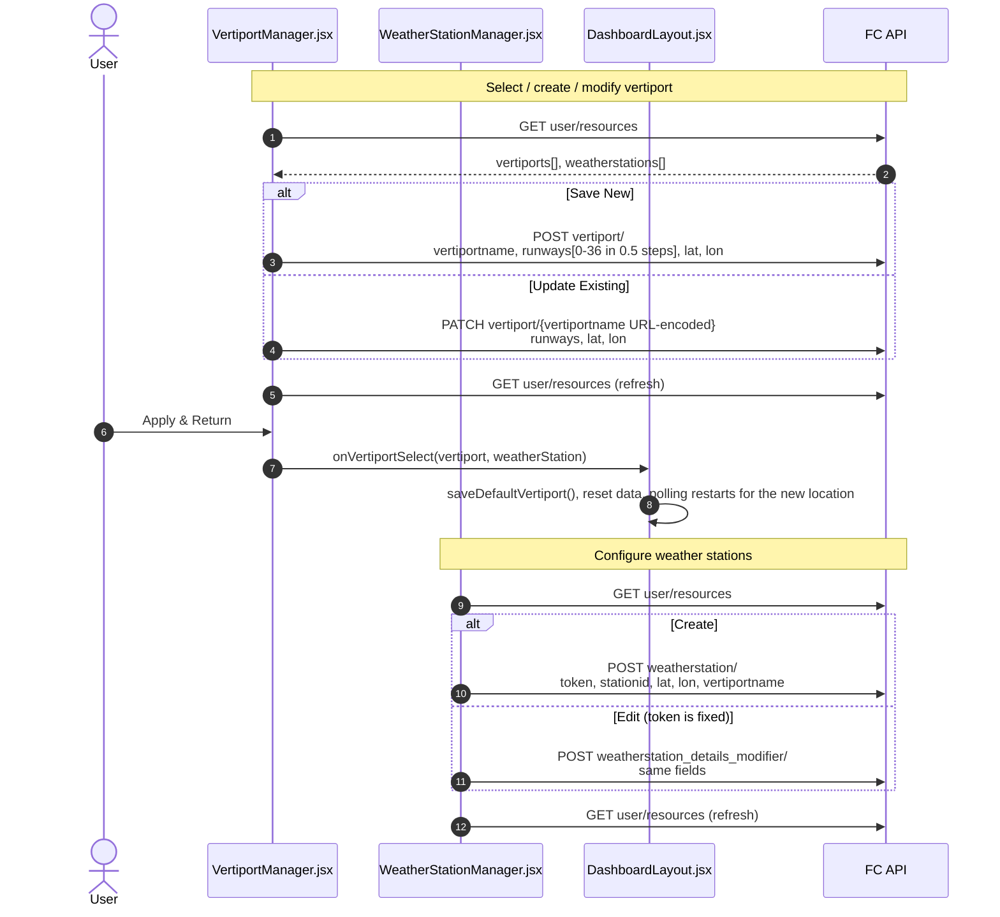
```mermaid
sequenceDiagram
    autonumber
    actor User
    participant VM as VertiportManager.jsx
    participant WS as WeatherStationManager.jsx
    participant D as DashboardLayout.jsx
    participant FC as FC API

    Note over VM,FC: Select / create / modify vertiport
    VM->>FC: GET user/resources
    FC-->>VM: vertiports[], weatherstations[]
    alt Save New
        VM->>FC: POST vertiport/<br/>vertiportname, runways[0-36 in 0.5 steps], lat, lon
    else Update Existing
        VM->>FC: PATCH vertiport/{vertiportname URL-encoded}<br/>runways, lat, lon
    end
    VM->>FC: GET user/resources (refresh)
    User->>VM: Apply & Return
    VM->>D: onVertiportSelect(vertiport, weatherStation)
    D->>D: saveDefaultVertiport(), reset data, polling restarts for the new location

    Note over WS,FC: Configure weather stations
    WS->>FC: GET user/resources
    alt Create
        WS->>FC: POST weatherstation/<br/>token, stationid, lat, lon, vertiportname
    else Edit (token is fixed)
        WS->>FC: POST weatherstation_details_modifier/<br/>same fields
    end
    WS->>FC: GET user/resources (refresh)
```

The frontend has no delete for either vertiports or weather stations.

---

## 7. Missions

**Files:** `pages/Missions.jsx`, `components/Missionquickdefinemodal.jsx`
(plus `MissionSidebarSection.jsx`, see 2c)

### 7a. Mission control page (`/missions`)

All calls go through the local `apiFetch()` with
`BASE = https://api.vertimonitor.dm-airtech.com`.

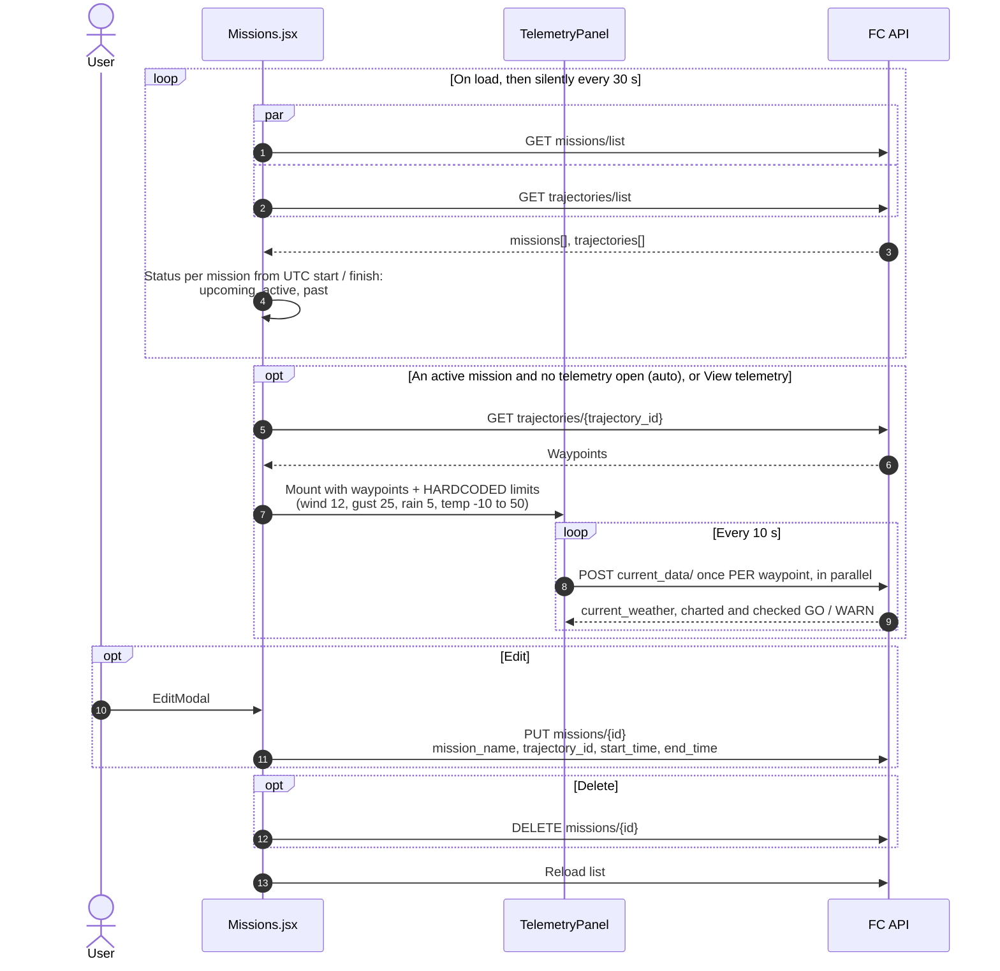
```mermaid
sequenceDiagram
    autonumber
    actor User
    participant M as Missions.jsx
    participant T as TelemetryPanel
    participant FC as FC API

    loop On load, then silently every 30 s
        par
            M->>FC: GET missions/list
        and
            M->>FC: GET trajectories/list
        end
        FC-->>M: missions[], trajectories[]
        M->>M: Status per mission from UTC start / finish:<br/>upcoming, active, past
    end

    opt An active mission and no telemetry open (auto), or View telemetry
        M->>FC: GET trajectories/{trajectory_id}
        FC-->>M: Waypoints
        M->>T: Mount with waypoints + HARDCODED limits<br/>(wind 12, gust 25, rain 5, temp -10 to 50)
        loop Every 10 s
            T->>FC: POST current_data/ once PER waypoint, in parallel
            FC-->>T: current_weather, charted and checked GO / WARN
        end
    end

    opt Edit
        User->>M: EditModal
        M->>FC: PUT missions/{id}<br/>mission_name, trajectory_id, start_time, end_time
    end
    opt Delete
        M->>FC: DELETE missions/{id}
    end
    M->>FC: Reload list
```

### 7b. Quick-define mission from a matrix cell

`Missionquickdefinemodal.jsx` is opened from a cell in the decision matrix,
through `TrajectoryMatrix` / `Cellactionpopover` *(verify)*.

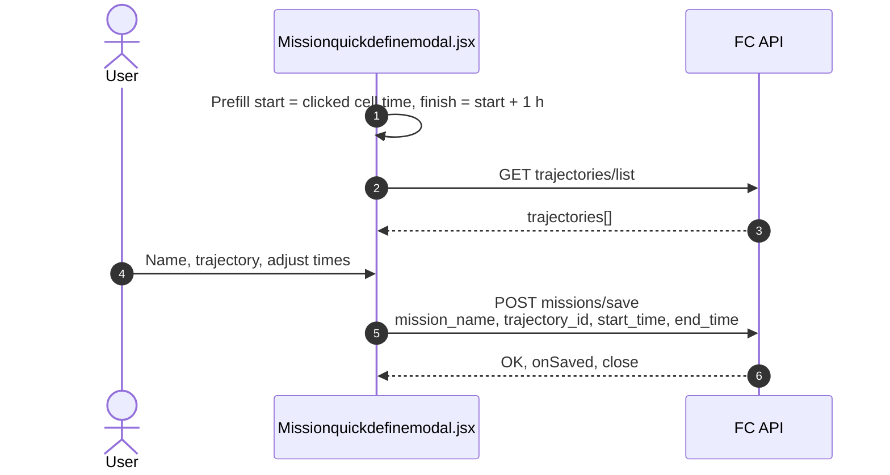
```mermaid
sequenceDiagram
    autonumber
    actor User
    participant Q as Missionquickdefinemodal.jsx
    participant FC as FC API

    Q->>Q: Prefill start = clicked cell time, finish = start + 1 h
    Q->>FC: GET trajectories/list
    FC-->>Q: trajectories[]
    User->>Q: Name, trajectory, adjust times
    Q->>FC: POST missions/save<br/>mission_name, trajectory_id, start_time, end_time
    FC-->>Q: OK, onSaved, close
```

---

## 8. Legacy / Unreachable Code

- **`pages/vertiport.jsx`** isn't imported anywhere. `/Vertiport` renders
  `DashboardLayout`. The file also imports `../components/Sensors` and
  `../components/Meteogram`, but both files live in `pages/`, so the page
  would fail to compile if anything imported it. It also reads the old
  drone-limit field names (`limit.code`, `wind_10`).
- **`pages/Meteogram.jsx`** is only used by `vertiport.jsx`, so it can't be
  reached either. For reference, it would call
  `POST trajectory_detailed_analysis/` for one point, 6 days ahead, every
  5 min.
- **`LightAircraftTrajectory.jsx` → `handleKmlFile` / `parseKmlToCoords`**
  are defined but never called. KML upload goes through `KMLFileUploader`
  in the Sidebar instead.
- **`apiCache.js` → `cachedFetch`, `cachedTrajectoryFetch`,
  `clearCachePattern`** are unused. `trajectoryCacl.jsx` imports
  `cachedFetch` but only uses `cacheUtils`.

---

## 9. Polling and Caching Summary

| Where | Endpoint | Interval | Cache |
|---|---|---|---|
| `DashboardLayout` | `airport/` (METAR) | 10 min | none |
| `DashboardLayout` | `current_data/` | 10 min | none |
| `DashboardLayout` | `sensor/client/` → `sensor/` → model fallback | `DEV_CONFIG.SENSOR_POLL_INTERVAL` *(verify value)* | none |
| `Missions` | `missions/list` + `trajectories/list` | 30 s | none |
| `Missions` → `TelemetryPanel` | `current_data/` × number of waypoints | **10 s** | none |
| `trajectoryCacl` | `vp_trajectory_analysis/`, `trajectory_detailed_analysis/` | on open | in-memory, 10 min |
| `trajectoryCacl` | `airport/` | on open | in-memory, 5 min |
| `trajectoryCacl` | whole result | on open | parent `cachedTrajectoryData` |
| `LightAircraftWeatherDecision` | `scan_times_detailed/`, `airport/` | every open | none |
| `DashboardLayout` | selected vertiport | — | `localStorage`, 30 days |

The in-memory `apiCache` is per browser tab and is lost on reload.

---

## 10. Endpoint → Caller Matrix

| Endpoint | Method | Called from |
|---|---|---|
| UM `/auth/password-login` | POST | `login.jsx` |
| UM `/auth/me` | GET | `AppContent.js` |
| UM `/subscriptions/status` | GET | `AppContent.js` |
| UM `/subscribe` | browser redirect | `AppContent.js` |
| `user/resources` | GET | `Sidebar.jsx` (drone_limits), `DashboardLayout.jsx` ×2, `VertiportManager.jsx` ×3, `WeatherStationManager.jsx` |
| `drone_limits/` | POST | `Sidebar.jsx` (new / clone profile) |
| `drone_limits_upsert/` | POST | `Sidebar.jsx` (edit own profile) |
| `drone_limits/{code}` | DELETE | `Sidebar.jsx` |
| `trajectories/list` | GET | `Sidebar.jsx`, `Missionquickdefinemodal.jsx`, `Missions.jsx` |
| `trajectories/{id}` | GET | `Sidebar.jsx`, `Missions.jsx` |
| `trajectories/{id}` | PUT | `Sidebar.jsx` |
| `trajectories/save` | POST | `Sidebar.jsx` |
| `missions/list` | GET | `Missions.jsx` |
| `missions/save` | POST | `MissionSidebarSection.jsx`, `Missionquickdefinemodal.jsx` |
| `missions/{id}` | PUT, DELETE | `Missions.jsx` |
| `vp_trajectory_analysis/` | POST | `trajectoryCacl.jsx` |
| `trajectory_detailed_analysis/` | POST | `trajectoryCacl.jsx`, `DashboardLayout.jsx`, (`Meteogram.jsx`, unreachable) |
| `scan_times_detailed/` | POST | `LightAircraftWeatherDecision.jsx` |
| `airport/` (model METAR) | POST | `trajectoryCacl.jsx`, `LightAircraftWeatherDecision.jsx`, `DashboardLayout.jsx` |
| `current_data/` | POST | `DashboardLayout.jsx`, `Missions.jsx` |
| `sensor/client/` | POST | `DashboardLayout.jsx` |
| `sensor/` | via `fetchSensorDataWithFallback` *(verify)* | `DashboardLayout.jsx` |
| `vertiport/` | POST | `VertiportManager.jsx` |
| `vertiport/{name}` | PATCH | `VertiportManager.jsx` |
| `weatherstation/` | POST | `WeatherStationManager.jsx` |
| `weatherstation_details_modifier/` | POST | `WeatherStationManager.jsx` |

---

